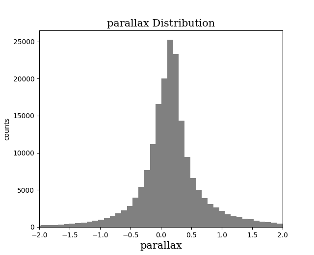
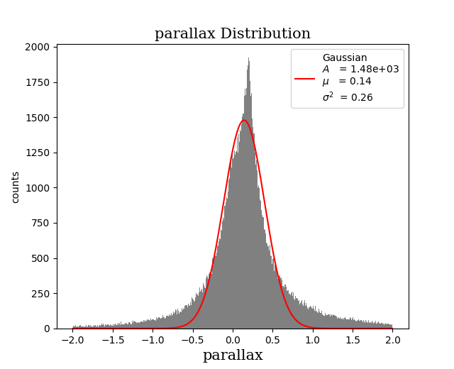
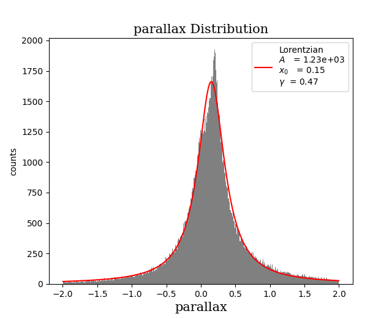
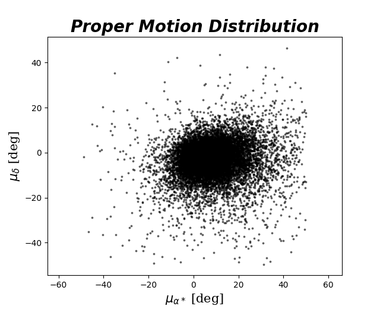
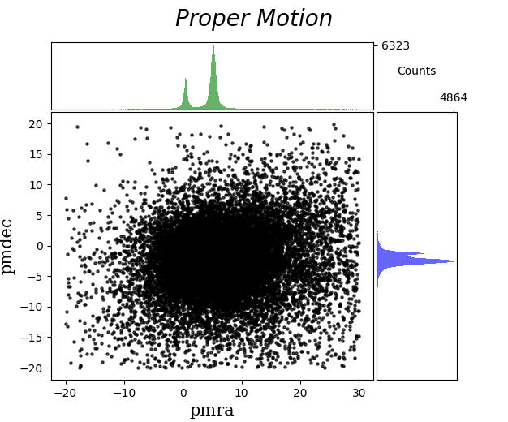

# GRASP - Globular clusteR Astrometry and Photometry Software
 

The GRASP package is a tool for astrophysical data analysis, mainly thought for Globular CLusters 
astrometric and photometric data retrievement and GCs dynamical evolution analysis.

## Table of Contents

- [Installation](#installation)
    - [Build R](#build-r)
    - [ANTLR4](#install-latex-parser-dependencies)
    - [GRASP](#installing-grasp)
- [Examples](#retrieving-data)

## Installation
Since this package uses a combination of Python (mainly), R, C and Fortran, some additional steps, as
to avoid errors in the code execution, must be done before installing the package.

<ins>NOTE</ins>: The use of a conda environment with `python >= 3.10` is highly recommended for the
correct functioning of the package.

<ins>NOTE2</ins>: All the extra steps necessay will be accounted for in the setup of the package 
itself, sooner or later...

### Build R
Firstly, one must install R, as the `statistics` module of the package uses R code to perform regression routines:

```bash
sudo apt update
sudo apt install r-base r-base-dev
```

This will install the latest R distribution, as well as all the base packages that coome with it. The
`dev` install makes sure the appropriate compilers are installed, so that R packages can be correctly
built upon installing them. If compiler errors arise (mentioning `GLIBCXX_3.4.XX not found for librosa`), try installing directly the `gcc` compiler:

```bash
conda install -c conda-forge gcc
```

### Install latex parser dependencies: ANTLR4
Since the `formulary` module, which handles formulas definitions and computations, use both the sympy
and the latex syntax interpreter, the latter needs an additional package to run: the ANTLR4 python 
routine. As of version `0.2.0` of GRASP, the precise version to install is:

```bash
pip install antlr4-python3-runtime==4.11
```

Equivalently:

```bash
conda install -c conda-forge antlr4-python3-runtime==4.11
```

### Installing GRASP
Finally, when everything is set up, install the package through the repository, as no PyPI release
exists yet:

```bash
pip install git+'https://github.com/pietroferraiuolo/GRASP.git'
```

<details>
<summary>Utilization Examples</summary>

### Retrieving data
Right now, the only implemented archive available for data retrievement is the GAIA archive.
It is comprehensive of various data tables, with the main table for data release `X`
being `gaiadrX.gaia_source`. To list all the available data tables:

```py
> import grasp

> grasp.available_tables() # or equivalentely grasp.gaia.query.available_tables()
"INFO: Retrieving tables... [astroquery.utils.tap.core]"
"INFO: Parsing tables... [astroquery.utils.tap.core]"
"INFO: Done. [astroquery.utils.tap.core]"
"external.apassdr9"
"external.catwise2020"
"external.gaiadr2_astrophysical_parameters"
.
. 
. # continuing with all available data tables
```

As for (gaia) data retrievement, there is the `grasp.gaia.query` module containing the `GaiaQuery`
class, which can be instanced with any of the availble tables, passed as a string. For example, if
one wants to work with GAIA DR2 data, simply:

```py
> dr2 = grasp.GaiaQuery('gaiadr2.gaia_source') # or grasp.gaia.query.GaiaQuery()
"Initialized with Gaia table: 'gaiadr2.gaia_source'"
```

Let's say we want to work with the latest (as of 2025) data release, DR3 (there is a fast alias for 
that):

```py
> dr3 = grasp.dr3()
"Initialized with Gaia table: 'gaiadr3.gaia_source'"
> dr3
"""
GAIADR3.GAIA_SOURCE
-------------------
This table has an entry for every Gaia observed source as published with this data release. 
It contains the basic source parameters, in their final state as processed by the Gaia Data 
Processing and Analysis Consortium from the raw data coming from the spacecraft. The table 
is complemented with others containing information specific to certain kinds of objects 
(e.g.~Solar--system objects, non--single stars, variables etc.) and value--added processing 
(e.g.~astrophysical parameters etc.). Further array data types (spectra, epoch measurements) 
are presented separately via Datalink resources.

<grasp.query.GaiaQuery class>"""
```

For an easy and fast astrometry (or photometry) data retrival, there are built-in functions.
Let's assume we want to retrieve astrometric data of all the sources falling within a circle on the 
sky, with radius $r=1.0\,\deg$ and center coordinates $(\alpha, \delta) = (6.02, -72.08) \deg$,
and we want to save the data obtained:

```py
> a_sample = dr3.get_astrometry(radius=1., ra=6.02, dec=-72.08, save=True)
"Not a Cluster: no model available"
"INFO: Query finished. [astroquery.utils.tap.core]"
"Sample number of sources: 229382"
"Path '.../graspdata/query/UNTRACKEDDATA' did not exist. Created."
".../graspdata/query/UNTRACKEDDATA/20250312_111553/query_data.txt"
".../graspdata/query/UNTRACKEDDATA/20250312_111553/query_info.ini"

> a_sample
"""
Gaia data retrieved at coordinates 
RA=6.02 DEC=-72.08

Data Columns:
source_id - ra - ra_error - dec - dec_error - 
parallax - parallax_error - pmra - pmra_error - pmdec -
"""
```

Every query will have a unique tracking numer identifier of the format `YYYYMMDD_hhmmss`. The query
returns a `grasp.Sample` object, which handles all data and cluster integration in one place. Common
`pandas` and `astropy.QTable methods are available`:

```py
> a_sample.head()
""" 
             SOURCE_ID        ra   ra_error        dec  dec_error  parallax  \
0  4689621262329503744  5.934553   0.537742 -72.252166   0.742929 -2.907118   
1  4689859169153623936  6.723713   0.234891 -71.538202   0.198667 -0.215250   
2  4688735017312170240  7.703532   0.189104 -72.891773   0.190288  0.002266   
3  4688735021593281792  7.674888   0.216690 -72.905171   0.215202 -0.011812   
4  4688735021595344896  7.688834  12.067017 -72.890149   5.270076       NaN   

   parallax_error      pmra  pmra_error     pmdec  pmdec_error  
0        0.691778  4.077426    0.623827 -0.533118     0.897007  
1        0.234868 -0.710963    0.298354 -0.390703     0.304819  
2        0.209810  0.565811    0.251735 -1.081986     0.262715  
3        0.232426  0.404157    0.278103 -1.143366     0.292574  
4             NaN       NaN         NaN       NaN          NaN  
"""

> a_sample.info()
"""
<Table length=229382>
     name       dtype    unit                              description                             n_bad
-------------- ------- -------- ------------------------------------------------------------------ -----
     SOURCE_ID   int64          Unique source identifier (unique within a particular Data Release)     0
            ra float64      deg                                                    Right ascension     0
      ra_error float32      mas                                  Standard error of right ascension     0
           dec float64      deg                                                        Declination     0
     dec_error float32      mas                                      Standard error of declination     0
      parallax float64      mas                                                           Parallax 38102
parallax_error float32      mas                                         Standard error of parallax 38102
          pmra float64 mas / yr                         Proper motion in right ascension direction 38102
    pmra_error float32 mas / yr       Standard error of proper motion in right ascension direction 38102
         pmdec float64 mas / yr                             Proper motion in declination direction 38102
   pmdec_error float32 mas / yr           Standard error of proper motion in declination direction 38102
"""
```

Since there is a big focus on globular clusters for the `grasp` package, the same result could be 
achieved by simply passing as arguments of the functions the radius and the GC name.

The center coordinates used in the previous example, are the coordinates for the center of the GC
*NGC 104* (as listed in the Harry's 2010 edition catalogue). So we can repeat the query like this:

```py
> a_sample = dr3.get_astrometry(radius=1., gc='ngc104', save=True)
"INFO: Query finished. [astroquery.utils.tap.core]"
"Sample number of sources: 229490"
"Path '.../graspdata/query/NGC104' did not exist. Created."
".../graspdata/query/NGC104/20250312_112905/query_data.txt"
".../graspdata/query/NGC104/20250312_112905/query_info.ini"

> a_sample
"""
Data sample for cluster NGC104

Data Columns:
source_id - ra - ra_error - dec - dec_error - 
parallax - parallax_error - pmra - pmra_error - pmdec - 
pmdec_error
"""
```

With the addition that we have now available useful data on the Cluster (<ins>NOTE</ins>: this is 
non other than an implementation of the `grasp.Cluster` class):

```py
> print(a_sample.gc)
"""
Harris Catalog 2010 edition Parameters

       Key                  Value
----------------------------------------
.id      Cluster Name       NGC104
.ra      Position in sky    RA  6.02 deg
.dec                        DEC -72.08 deg
.dist    Distance           4.50 kpc
.w0      W0 Parameter       8.82
.logc    Concentration      logc=2.07
.cflag                      Collapsed -> False
.rc      Core radius        0.006 deg
.rh      Half-Light radius  0.053 deg
.rt      Tidal Radius       0.705 deg
"""
```

All the "fixed" query functions (`.get_astrometry`, `.get_photometry`, `.get_rv`) support an additional
parameter the conditions to be applied on the query. As example

```py
> conditions = ['parallax IS NOT NULL', 'parallax > 0', 'pmra IS NOT NULL', 'pmdec IS NOT NULL'] # uses ADQL
> newsample = dr3.get_astrometry(radius=1., gc='ngc104', conds=conditions)
"INFO: Query finished. [astroquery.utils.tap.core]"
"Sample number of sources: 131482"
```

We can see how the conditions were applied, excluding quite the number of sources.

While for these functions the data retrieved is fixed, there is the `.free_query` functions which, as
the name suggests, accepts bot the `data` and `conditions` additional arguments to customize the query.

### Data visualization
Let us work with the `a_smple` and the `newsample` from before. All the possible builtin visualization
functions of the `grasp` package, are within the `plots` module.

```py
> from grasp import plots as gplt # gplt -> grasp.plots
```

Just as (cool) examples, let's visualize the `parallax` distributions of the samples, as well as the
`proper motion` plots.

```py
> gplt.histogram(a_sample.parallax, xlabel='parallax', xlim=(-2,2))
```


With so many sources, the visualization is not great, so that limits have been applied. One coul even
perform analysis at the fly, like _Kerlen Density Estimation_ (here instead of putting limits to the
visualization only, the sample itself has been restricted, to gain resolution on the histogram bins)

```py
> gplt.histogram(
    a_sample.parallax[(a_sample.parallax > -2) & (a_sample.parallax < 2)], 
    kde=True, 
    kde_kind='gaussian', 
    xlabel='parallax'
  )
"Correctly imported `minpack.lm`."
```


And one could see that the distribution is better fitted by a lorentian distribution function
rather than a normal:

```py
> gplt.histogram(
    a_sample.parallax[(a_sample.parallax > -2) & (a_sample.parallax < 2)], 
    kde=True, 
    kde_kind='lorentzian', 
    xlabel='parallax'
  )
"Correctly imported `minpack.lm`."
```


Another example of visualization are the builtin `proper motion` plot and the `doubleHistScatter` plot:

```py
> conditions = {
...     'pmra':'>-50',
...     'pmra':'<50',
...     'pmdec':'<50',
...     'pmdec':'>-50'
}
> restricted_sample = newsample.apply_conditions(conditions)
> # here we are restricting the sample for visualization purposes and is equivalent to
> # restricted_sample = newsample[(newsample.pmra >-50) & (newsample.pmra < 50) & (newsample.pmdec >-50) & (newsample.pmdec < 50)]
> # with the only difference being that with the second method, a `QTable` is returned, while in the first
> # a `Sample` istance
> gplt.properMotion(restricted_sample)
```


The `doubleHistScatter` plot is a scatter plot with projected distributions of the data in their axes
(with the `kde` option too)

```py
> gplt.doubleHistScatter(restricted_sample['pmra'], restricted_sample['pmdec'], ylabel='pmdec', xlabel='pmra', title='Proper Motion')
```



### Computing formulas


</details>
